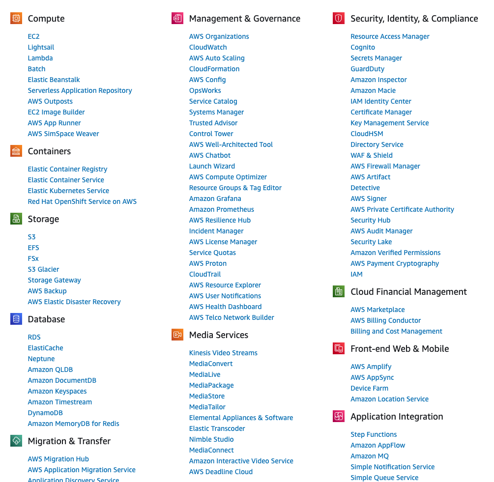

### What is cloud computing? the key characteristics

| Name                    | Description                                                                                                             |
| ----------------------- | ----------------------------------------------------------------------------------------------------------------------- |
| On-demand, self-service | A user can consume cloud resources, as needed, automatically, any without human interaction                             |
| Broad network access    | Capabilities are available over the network using standard mechanisms. Can be the internet or a Wide Area Network (WAN) |
| Resource pooling        | The providers resources are pooled and serve multiple consumers using a multi-tenant model                              |
| Rapid elasticity        | Capabilities can scale "elastically" based on demand                                                                    |
| Measured service        | Resource usage is monitored and metered                                                                                 |

Brief: **Cloud Computing** is the on demand delivery of IT resources over the internet with pay-as-you-go pricing. In simple word _cloud computing_ is a way to use computing services, like storage, databases, and servers, over the internet instead of using local computers or servers.

### Benefits:

- No need to invest in expensive hardware or maintain it.
- You can size your website and database according to what you need.
- Access your data and applications from anywhere with an internet connection.

#### Launching cloud services: Management console

- You can use a graphical user interface in a web browser in order to launch services on the cloud.
  So an example of this is the AWS management console.
  
  From here you can choose a service under a certain category like you can choose EC2 if you want to launch a server in the cloud or S3 if you want to store some data on the cloud.
  You can access this through a standard web browser so you do not need any special software.
- Command line, with the command line you have to install something on your computer , like command line interface from your cloud service provider and then you can run commands from anywhere on the internet and launch cloud services.

- Code (SDK): in this case a developer is going to write some code in what's called an integrated development environment (IDE). You can write some code and then use that to launch services in the cloud.

### Cloud Service Models and cloud deployment models

#### 1. Cloud Service Models

- **Private Cloud** : Dedicated cloud for one organization, providing high control and security.(You manage everything greater responsibility + greater control)
- **Infrastructure as a Service (IaaS)** : Provides virtualized infrastructure resources like servers and storage. (You manage from the virtual server upwards)
- **Platform as a Service (PaaS)** : Provides a platform for developing and managing applications without managing the underlying infrastructure. ( You simply upload your code/data to create your application)
- **Software as a Service** : Provides fully functional software applications over the internet, managed by the provider. (You simply consume the service - little responsibility + little control)

#### 2. Cloud Computing Deployment Models

| Name          | Description                                                                                                                                                                                     | Examples                                                                |
| ------------- | ----------------------------------------------------------------------------------------------------------------------------------------------------------------------------------------------- | ----------------------------------------------------------------------- |
| Public Cloud  | Cloud services are provided over a network that is open for public use.                                                                                                                         | Amazon Web Services (AWS), Microsoft Azure, Google Cloud Platform (GCP) |
| Private Cloud | Cloud services are dedicated to a single organization and are not shared with other organizations. (An enterprise deploys their own infrastructure and applications into their own data center) | OpenStack, VMware, Microsoft, RedHat                                    |
| Hybrid Cloud  | A combination of on-premises, private cloud, and public cloud services are consumed                                                                                                             |                                                                         |
| Multi Cloud   | Usage of two or more public clouds at a time, and possibly multiple private clouds                                                                                                              |                                                                         |
